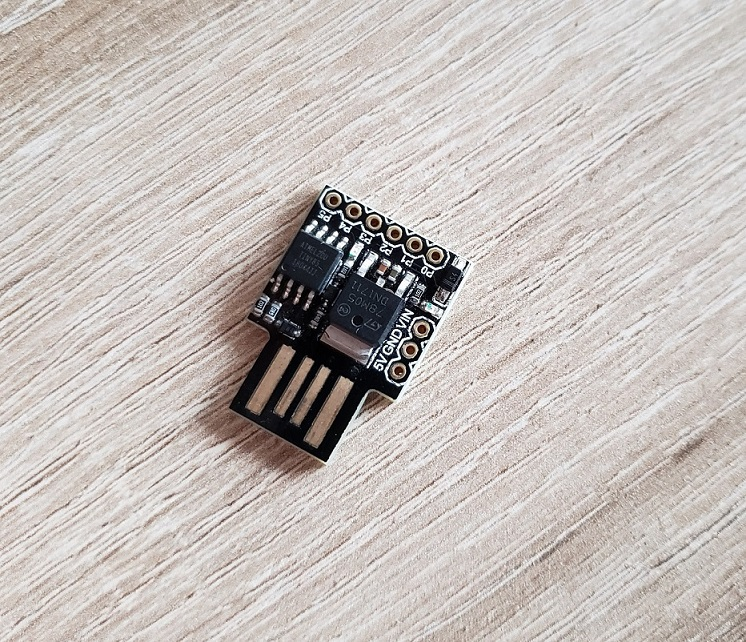
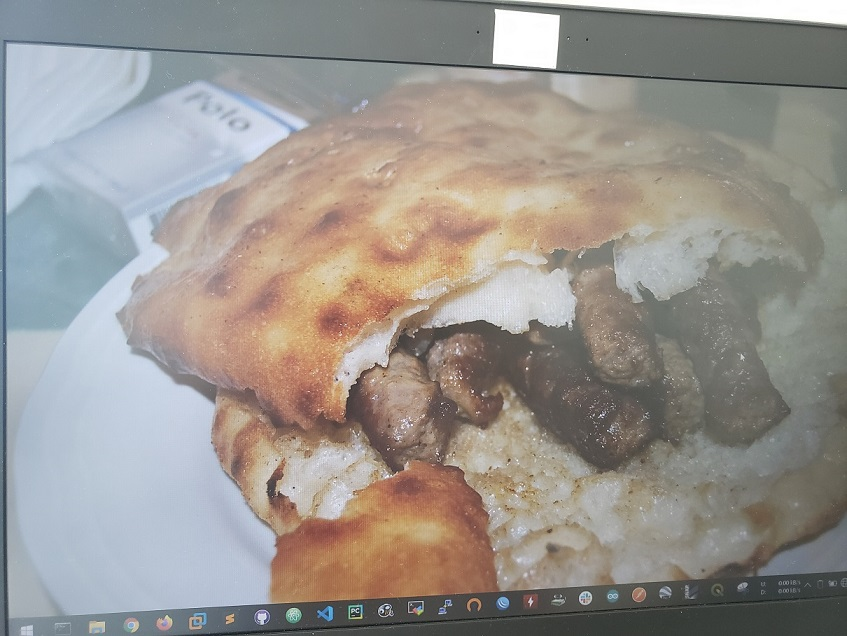
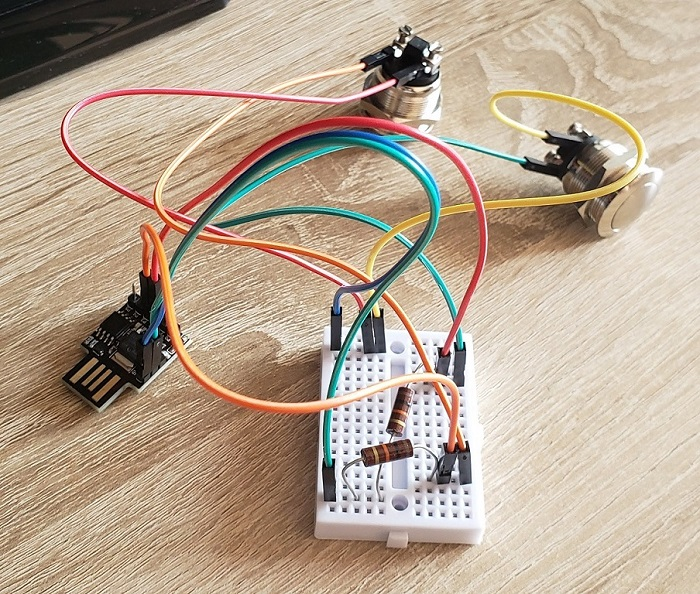
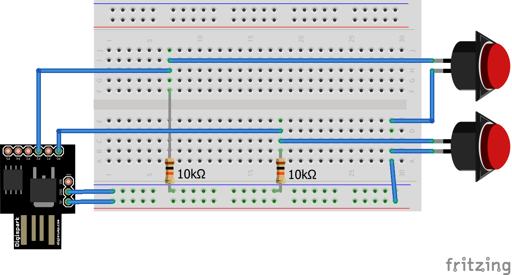
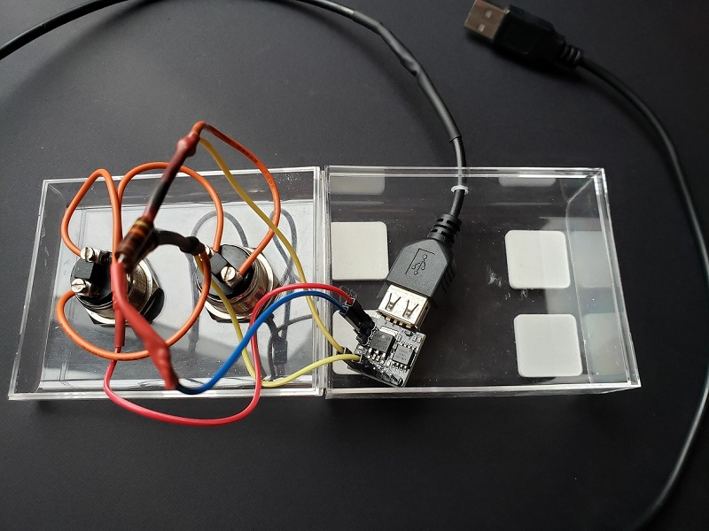
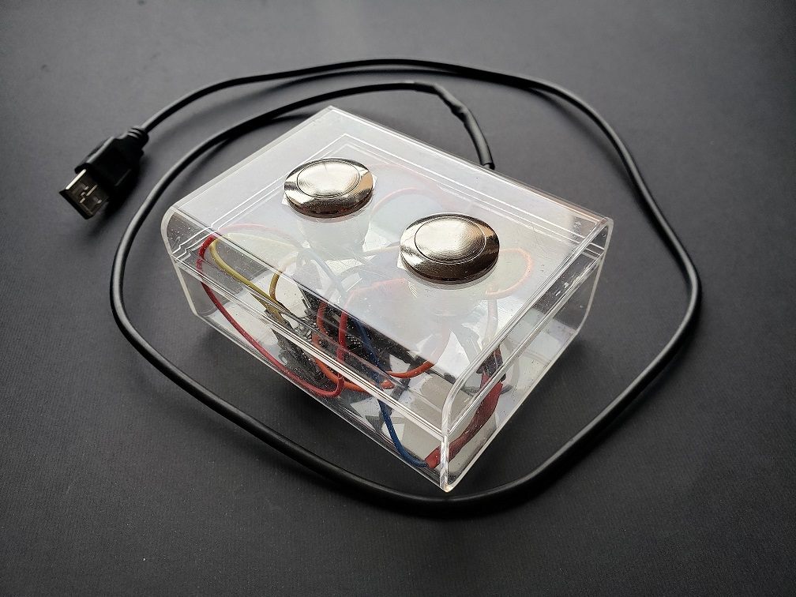
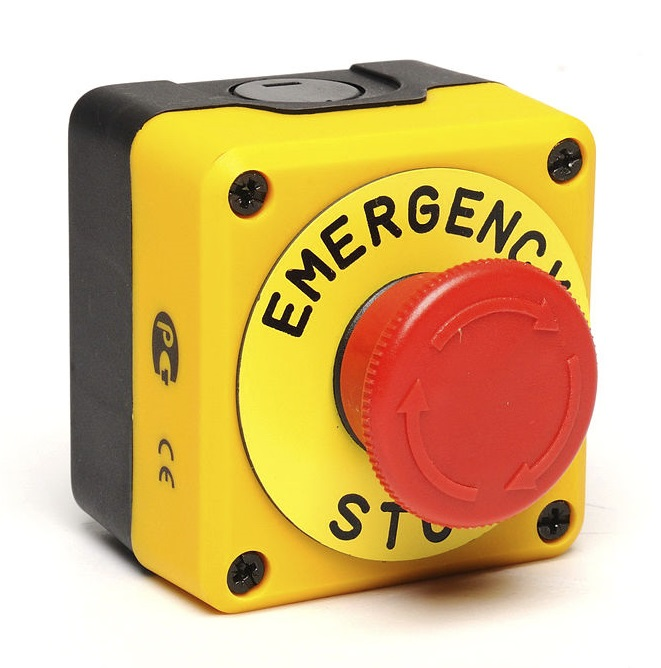

# Digispark mini projects

## Introduction

The [Digispark](http://digistump.com/products/1) is a cute little board based on the Attiny85 microcontroller which can be programmed similar to any other Arduino board.

With its tiny size is can be used for a lot of small projects, one of which is as a cheap alternative to the [Rubber Ducky](https://shop.hak5.org/products/usb-rubber-ducky-deluxe). If you are a fan of Mr Robot ([episode 4x10](https://pbs.twimg.com/media/ELAP99DW4AAlsEd?format=jpg&name=large)) then you probably know that the Digispark can be used for malicious stuff.

Basically what these devices can do is pretend to be a HID (e.g. keyboard) this means automatically and superfast typed commands! I used one of these as a Security Awareness training on my colleagues, nothing malicious, just open PowerShell > get a picture online > set it as wallpaper, in just a few seconds!

this GIF is in real-time and the result after next login: ćevapi wallpaper!
\*heavy slavic breathing\*

If you have seen this trick with this exact wallpaper somewhere else, that is because 'someone' used the same code and represented as their own. I don't mind copying the code, it's open source but FFS just change the image or something and don't let it be so obvious... < /rant>  

What we learn from this is:
- always lock you computer when not using
- don't stick random USB flash drives to your/companies computer
- don't steal from your (ex)colleagues

## Prerequisites:
Before you can use these tiny boards, you need to install the Arduino IDE and also the drivers for the boards

- Download and install the [Arduino IDE](https://www.arduino.cc/) and open it
- File > Preferences >
  - in the Additional Boards Manager URLs paste the following link:
    http://digistump.com/package_digistump_index.json
  - press OK
- Tools > Board > Board Manager >
  - in the search box type "Digistump". "Digistump AVR Boards" should popup first
  - click on the install button  
- Tools > Boards > select "Digispark default"
- install drivers (Windows users)
  - go to: https://github.com/digistump/DigistumpArduino/releases
  - download the **Digistump.Drivers.zip**
  - unzip, install
    - **DPinst64.exe** for 64-bit  
    - **DPinst.exe** for 32-bit

---
# Google Meet audio/video shortcut keys

There are some similar projects with some other boards that are made for other video meeting services and since this work-from-home thing is going to last I made use of them instead of lying in the drawer.

Here's everything connected on a breadboard:

here's the diagram:

and here's the complete wiring inside a plastic box (without breadboard)

Finished product:

I'm thinking of making a wooden box instead of this, but will see...

The [code](scripts/google_meet.ino) is pretty straightforward. Just plug it in and it should works on any computer, no drivers are needed to install because it's basically a keyboard.

(tested on Windows and Linux. I will update the code when I get the opportunity to test it on OSX)

---
# Emergency screen lock

- did the security team always say to lock your computer?
- is pressing a keyboard combination too much hassle for you?
- ever wondered if you could have just one press of a button?

Fear no more! Here's the **emergency screen lock button!**

jokes aside, this was an idea what I wanted to make but since this pandemic started I couldn't find one of these in the local shops, nor online which had normal shipping price & time. If you wanna try, here's the [code](scripts/win_lock.ino). (on OSX the lock screen key combination is different, so need to change that)

also, if you reading this from the future and asking yourself "which pandemic I'm talking about" well it is/was [COVID-19](https://en.wikipedia.org/wiki/Coronavirus_disease_2019).

---
# Mouse jiggler / circler

are used in Digital Forensics to prevent the screen from locking. I saw some of these USB mouse jigglers selling for +$20!

You can make your own for way cheaper using a Digispark, works perfectly fine unless the system you plugging it in has some kind of protection against HID attacks.

Here's the [code](scripts/mouse_circle.ino)

